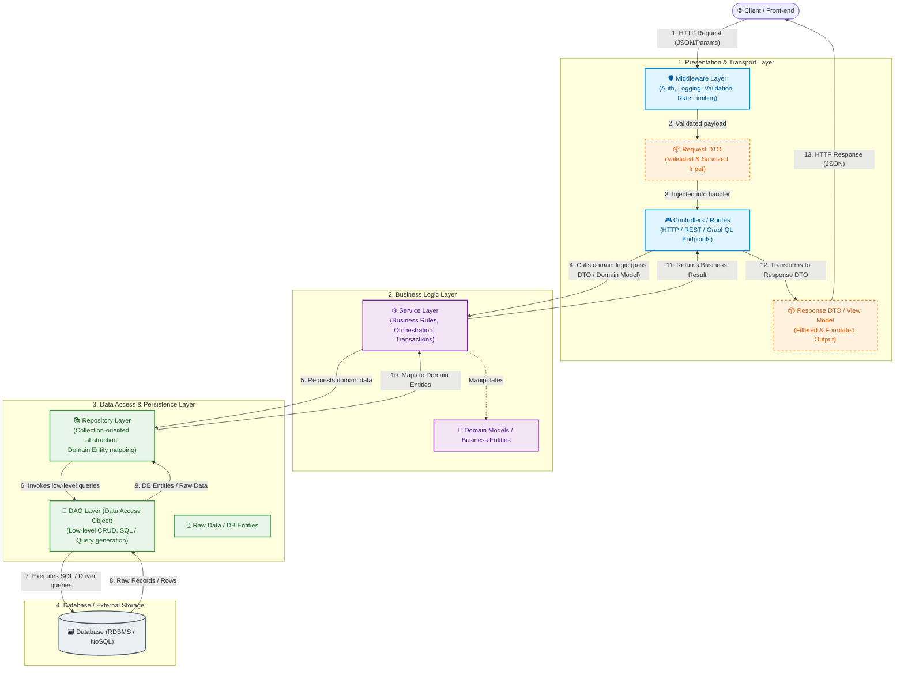
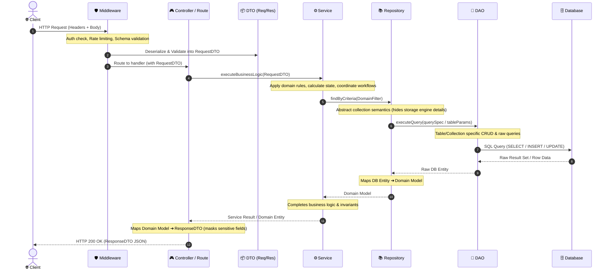

# To-Do List API

A small Express + TypeScript REST API that manages a to-do list backed by PostgreSQL (`pg`).
It supports the four CRUD operations — create, read, update, and delete — on tasks, search, filtering, and stats, and ships with interactive Swagger UI documentation at `/docs`.

## Screenshots


## Why PostgreSQL is Superior to SQLite in Production

While SQLite is exceptional for local prototyping, testing, embedded systems, and mobile applications, PostgreSQL is the standard industry choice for production web services. Here is why PostgreSQL is superior in production environments:

| Feature / Capability | SQLite | PostgreSQL (Production Standard) |
| :--- | :--- | :--- |
| **Concurrency & Locking** | Database-level file locking. Only **one write transaction** can execute at a time. High concurrent write traffic causes `SQLITE_BUSY` bottlenecks. | **MVCC (Multi-Version Concurrency Control)** & row-level locking. Hundreds of concurrent read and write transactions execute simultaneously without blocking each other. |
| **Multi-Instance Scaling** | Single file on local filesystem. Cannot be shared across multiple horizontal instances (Kubernetes, AWS ECS, multiple API pods) without network filesystem issues. | **Client-Server Architecture**. Multiple distributed application servers/containers can connect concurrently to a single database cluster. |
| **Data Types & Integrity** | Manifest typing (weak typing). Any column (except `INTEGER PRIMARY KEY`) can store any data type. | **Strict static typing & rich data types** (`UUID`, `JSONB`, `TIMESTAMPTZ`, `INET`, arrays, custom enums) with comprehensive constraints. |
| **High Availability & Replication** | Complex to replicate in real-time across multiple nodes. | Native **streaming replication, read replicas, automated failover**, and clustering solutions (e.g., Patroni). |
| **Backups & Point-in-Time Recovery** | Requires copying the file or vacuuming; no native WAL streaming across network. | **Continuous WAL archiving & Point-in-Time Recovery (PITR)** to restore the database to any exact millisecond. |
| **Access Control & Security** | File-system permissions only. No granular roles, user authentication, or row-level security. | Granular **Role-Based Access Control (RBAC)**, connection encryption (SSL/TLS), and Row-Level Security (RLS). |

---

## Advantages of `.env` Files (Environment Configuration)

Following the [Twelve-Factor App methodology (Config)](https://12factor.net/config), storing application configuration in environment variables / `.env` files provides several critical advantages:

1. **Security & Credential Protection**:
   - Keeps secrets, database passwords, API tokens, and private keys out of the source code repository.
   - Prevents accidental exposure of sensitive credentials on public or shared git repositories when `.env` is properly `.gitignore`d.
2. **Environment Parity & Flexibility**:
   - Allows the exact same codebase and build artifact to run in development, testing, staging, and production simply by supplying different environment variables (e.g., `DATABASE_URL`, `PORT`, `NODE_ENV`).
3. **Easy Configuration in CI/CD & Cloud Providers**:
   - Environment variables are natively supported by Docker, Kubernetes, AWS, GCP, Azure, GitHub Actions, and container orchestrators without requiring code changes or rebuilds.
4. **Centralized & Clean Configuration**:
   - Provides a single, clear place (`.env.example`) to document all required environment settings for onboarding new team members.

---

## Advantages of Using Docker Containers

Packaging the application and its dependencies into Docker containers provides significant benefits for development and deployment:

1. **Elimination of "Works on My Machine" Syndrome**:
   - Standardizes the runtime environment (Node.js version, OS libraries, C/C++ build tools) across macOS, Windows, and Linux machines.
2. **Isolated & Reproducible Dependencies**:
   - The application runs in its own isolated filesystem and network namespace, avoiding conflicts with host packages or differing local software versions.
3. **Multi-Service Orchestration with Docker Compose**:
   - Spins up both the API and the PostgreSQL database with a single command (`docker compose up --build`), including private internal networking, volume persistence, and startup health checks.
4. **Portability & Cloud-Ready Deployment**:
   - Container images are immutable, self-contained artifacts that can be pushed to container registries (Docker Hub, AWS ECR, GCP GCR) and deployed seamlessly to Kubernetes, ECS, Cloud Run, or VPS instances.
5. **Fast Onboarding & Ephemeral Testing**:
   - New contributors can clone the repo and run the full stack in seconds without manually installing PostgreSQL or setting up local database users and ports.

---

## Database Initialization & Seed Data

- When running via Docker Compose or local PostgreSQL, the app connects to the database via `DATABASE_URL`.
- The database schema is **initialized automatically** on startup with `CREATE TABLE IF NOT EXISTS "tasks"`.
- Initial seed tasks are inserted automatically only on the first run (when the table is empty).

## Layered Monolithic Architecture & DAO vs Repository

In this task, I aimed to learn and practice layered monolithic architecture. I even refactored my codebase into DTOs and DAOs. Finally, I clarified the distinction between the Repository and DAO layers, and when to use each separately or in combination. The following table highlights the differences clearly:

| Aspect | DAO (Data Access Object) | Repository |
|--------|--------------------------|------------|
| **Abstraction level** | Low—mirrors database structure closely | High—models domain concepts |
| **Concern** | How data is persisted (SQL, queries) | What data is needed for business logic |
| **Design focus** | Database-centric | Domain-centric (DDD influence) |
| **Typical use** | CRUD operations on tables | Business aggregate operations |
| **Query complexity** | Often exposes raw queries | Encapsulates complex queries into named methods |

### High-Level Architectural Schematic Diagram



## End-to-End Request/Response Lifecycle



## Layer Responsibilities & Separation of Concerns

| Layer / Component | Primary Responsibility | Input / Output | Key Patterns & Technologies |
| :--- | :--- | :--- | :--- |
| **Middleware** | Interception, authentication, CORS, rate-limiting, and input sanitization. | `Raw HTTP Request` ➔ `Enriched Context` | Chain of Responsibility, Interceptor |
| **DTO (Data Transfer Object)** | Decouples internal database/domain structures from public API contracts; enforces validation schemas. | `JSON/Query` ➔ `Typed Object` (and vice versa) | Data Transfer Object, Schema Validators (Zod, Joi, class-validator) |
| **Controller / Routes** | Parses HTTP status codes, handles headers/cookies, and maps requests to services. | `Request DTO` ➔ `Response DTO` | MVC, Front Controller |
| **Service Layer** | Implements core business logic, transaction boundaries, and orchestration. | `DTO / Domain Model` ➔ `Domain Result` | Transaction Script, Domain Service |
| **Repository Layer** | Emulates an in-memory collection of domain objects; mediates between domain models and data mapping. | `Domain Model` ➔ `Domain Model` | Repository Pattern, Data Mapper |
| **DAO Layer** | Direct low-level persistence operations (SQL/NoSQL query execution, table schemas). | `Domain/Query Params` ➔ `Raw DB Rows / Entities` | Data Access Object, Table Data Gateway |
| **Database** | Permanent storage engine. | `SQL / BSON / CQL` ➔ `Storage I/O` | PostgreSQL, MySQL, MongoDB, Redis |

## Install & Run

One documented command to install dependencies and start the server:

```bash
npm install && node src/app.ts
```

The server starts on **http://localhost:3000**.  
Interactive API docs are available at **http://localhost:3000/docs**.

## Endpoints

| Method   | Path         | Description                                                        | Success |
|----------|--------------|--------------------------------------------------------------------|---------|
| `GET`    | `/`          | API info (name, version, endpoints)                                | 200     |
| `GET`    | `/health`    | Health check (`{ "status": "ok" }`)                                | 200     |
| `GET`    | `/tasks`     | List tasks (supports `?done=true/false` and `?search=<query>`)    | 200     |
| `POST`   | `/tasks`     | Create a new task (`{ "title": "...", "done": false }`)            | 201     |
| `GET`    | `/tasks/:id` | Get a single task by ID                                            | 200     |
| `PUT`    | `/tasks/:id` | Update a task's `title` and/or `done`                              | 200     |
| `DELETE` | `/tasks/:id` | Delete a task                                                      | 204     |
| `GET`    | `/stats`     | Task statistics via SQL `COUNT()` (`{ total, done, open }`)         | 200     |
| `POST`   | `/reset`     | Reset database to the initial 3 seed tasks                         | 200     |

## Example

```bash
$ curl -i http://localhost:3000/tasks

HTTP/1.1 200 OK
Connection: keep-alive
Keep-Alive: timeout=5
Content-Length: 117
Content-Type: text/html; charset=utf-8
Date: Mon, 27 Jul 2026 01:42:05 GMT
ETag: W/"75-7hvHNFe4C9UBIYQ/i1+IZv+x3F..."

[{"id":1,"title":"Task 1","done":false},{"id":2,"title":"Task 2","done":true},{"id":3,"title":"Task 3","done":false}]
```
